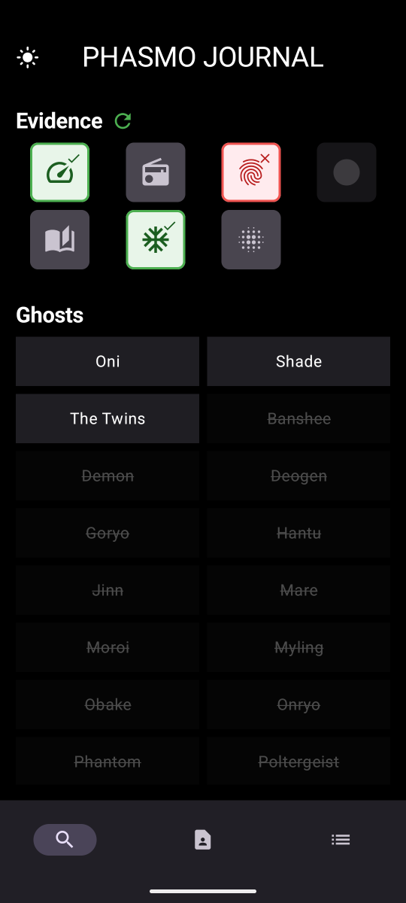
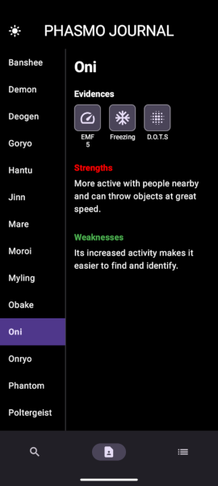
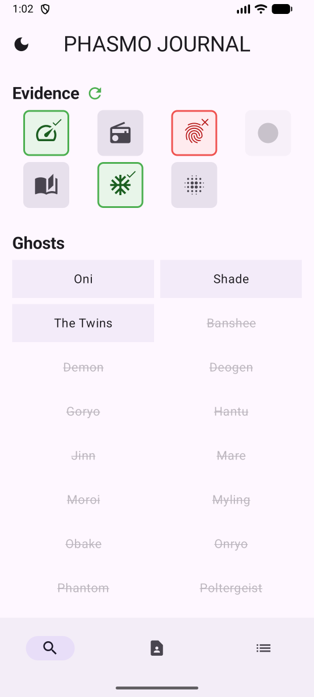

# Phasmo Journal

A free, ad-free companion app for the game [Phasmophobia](https://store.steampowered.com/app/739630/Phasmophobia/) to help you track evidence and identify ghosts.

**Supported on Android 7.0 (Nougat) and higher.**

## Screenshots

  
  
  

## Features

-   **Evidence Tracker**: Easily select found or ruled-out evidence.
-   **Smart Ghost List**: Automatically filters the ghost list based on your evidence and sorts ruled-out ghosts to the bottom.
-   **Possible Evidence Highlighting**: See which remaining evidence is relevant for the possible ghosts.
-   **Detailed Ghost Info**: View strengths, weaknesses, and required evidence for every ghost.
-   **Change Log**: Keep track of app updates.
-   **Theme Switching**: Supports both light and dark modes.
-   **Ad-Free**: No ads, no interruptions.

## License

This project is licensed under the MIT License - see the [LICENSE](LICENSE) file for details.
